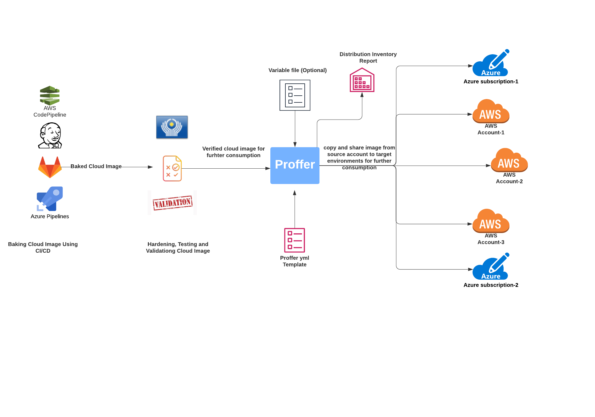

# Proffer

[](https://github.com/mohit-kumar-sharma/proffer/releases)
[](https://codecov.io/gh/mohit-kumar-sharma/proffer)


[](https://github.com/pre-commit/pre-commit)
[](https://goreportcard.com/report/github.com/mohit-kumar-sharma/proffer)

## Introduction:

Proffer is a cross platform command line tool to copy and share the cloud images across multiple regions and accounts. It is a lightweight tool that can be used on any major platform.

## Use Case:

There can be use-case where we are building cloud images and we don't want to distribute them until we are confident enough that the new image does not contains any vulnerabilities and it works as expected. So in those cases after confirming that we have a cloud image that can be consumed by different environments, we need some tool or custom scripts to copy and share these cloud images from CI account (source account) to target accounts (consumer accounts like, dev, pre-prod, and prod.).

Having custom scripts can be painful, because we need to maintain a separate set of things to just distribute the ami and its also not flexible and easy to use for everyone unless they know that process already. So to solve this problem, we have created a tool called `Proffer` that can solve these kinds of problem for any cloud provider. But currently it only support AWS, but support for other cloud providers can be added easily using resource plugin.

Some features of proffer:

* It uses a yml config file called proffer.yml, so its easy to define what we want.
* It is very fast and easy to use.
* In build bash and zsh completion.
* In build validation for yml config file.
* It allows to use dynamic and default variables in template file.
* It has lots of advanced features, like copy the tags across regions and accounts, share different kins of ami permission for target accounts, adding extra tags.
* It generates proffer inventory report on successful execution.

## Supported Cloud Providers:

* AWS

Support for the other cloud providers can be added via resource plugin.

## How Proffer works:

Proffer command takes a template called `proffer.yml` written in yaml format and apply the resources defined in template. Each proffer template has a top-level section called `resources` that is list of proffer resources.
Each resource then have their own properties like type, keys and etc. To find all available proffer resources, visit [Available Proffer Resources](resources/README.md) page.

In addition, proffer also allows us to use the dynamic and default variables defined at different places. To process dynamic variable's values in proffer template, we need to pass the variable file to proffer command using `--var-file` flag.



## Quick Start:

To quickly start with proffer , you can follow the [quick-start-guide](quickstart-guide/main.md).

## Resources Available In Proffer:

Resource is a component in proffer. Each resources is responsible to perform a particular set of operations. Proffer has different kinds of resources. For more details, check [Available Proffer Resources](resources/README.md).

## Access Environment Variables:

To access the environment variables within proffer template , we can use below format:

``` Yaml
Home: {{ env "HOME" }}
```

If we want to set default value of a environment variable if its not set then we can use below format:

``` Yaml
Home: {{ env "HOME" | default "default home dir path" }}
```

## Define dynamic variables in variables file and default variables in template file:

Proffer also allows us to define the dynamic variables in a separate variable file and use them in proffer
template file. Similarly define default variables and use them in template file. To resolve their values in template file we need to pass this variable file in proffer `validate` and `apply` commands using `--var-file` argument.

For more details take a look at [How to use variables in template file](quickstart-guide/variables/main.md)

## Inventory Report:

Proffer generates an inventory report on the successful execution. This report contains all information about image
distribution like where is the source image located ,where are target images created and with which accounts and regions source image was shared.

If we want to change the name of the inventory file generated, we can use `--inventory` option in `proffer apply command` to pass the custom name for inventory being generated. By default report name is `inventory.yml`.

Inventory report sample can be found at [sample-inventory-report](output-samples/example-inventory.yml)

## Command-line documentation:

To check what are the options are available in each proffer command and sub-command, visit [cli-doc](doc/proffer.md) page.

## License:

Proffer is released under the Apache License, Version 2.0.
